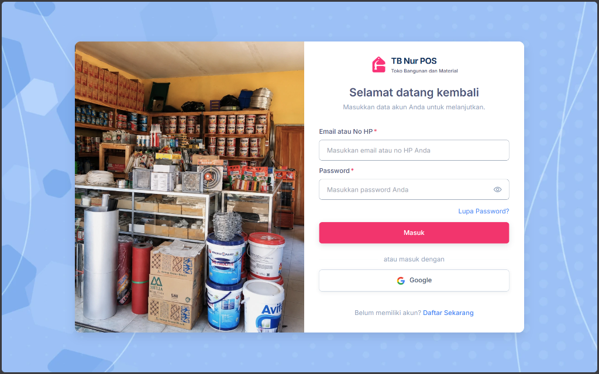

# Sistem POS & Manajemen Operasional Toko Bangunan (TB Nur)

Aplikasi web untuk mendukung operasional harian Toko Bangunan **TB Nur**, mencakup transaksi kasir, pengelolaan persediaan material, pencatatan transaksi tempo (piutang & hutang), arus kas, hingga laporan keuangan usaha.



---

## 📌 Ringkasan Fitur

- **Kasir & Penjualan (POS)**  
  Mendukung transaksi tunai maupun tempo, pencatatan uang muka (DP), cetak nota, dan retur penjualan.
- **Pembelian & Hutang Supplier**  
  Pencatatan faktur barang masuk dari pemasok, pemantauan jatuh tempo, dan riwayat pembayaran hutang.
- **Manajemen Persediaan & Gudang**  
  Monitoring stok multi-gudang, penyesuaian stok fisik (opname), dan kalkulasi harga pokok otomatis berbasis metode FIFO.
- **Kas & Perbankan**  
  Pencatatan penerimaan dan pengeluaran kas operasional serta transfer saldo antar-rekening toko.
- **Laporan & Rekapitulasi**  
  Laporan laba kotor, ringkasan piutang/hutang, mutasi kas/bank, dan kartu riwayat pergerakan stok barang.
- **Workspace Multi-Tab**  
  Navigasi modular yang memungkinkan pengguna membuka beberapa menu sekaligus tanpa kehilangan data isian form saat berpindah tab.

---

## 💻 Kebutuhan Sistem & Teknologi

- **Backend**: PHP 8.3+ (Laravel 11)
- **Frontend**: React 19, Inertia.js, Tailwind CSS
- **Database**: MySQL 8.0+ / MariaDB
- **Build Tool**: Vite 7+

---

## 🚀 Panduan Instalasi & Menjalankan Aplikasi

1. **Pasang Dependensi Backend & Frontend:**
   ```bash
   composer install
   npm install
   ```

2. **Konfigurasi Environment:**
   Salin berkas `.env.example` menjadi `.env` lalu sesuaikan konfigurasi database:
   ```bash
   cp .env.example .env
   php artisan key:generate
   ```

3. **Migrasi Database & Data Awal:**
   ```bash
   php artisan migrate --seed
   ```

4. **Jalankan Server Pengembangan:**
   ```bash
   composer run dev
   ```
   Aplikasi siap diakses melalui browser pada alamat default `http://localhost:8000`.

---

## 📄 Catatan Penggunaan

Aplikasi ini dikembangkan khusus sesuai alur operasional Toko Bangunan TB Nur. Hak akses data master, konfigurasi usaha, dan catatan transaksi sepenuhnya berada di bawah kendali pemilik toko.
