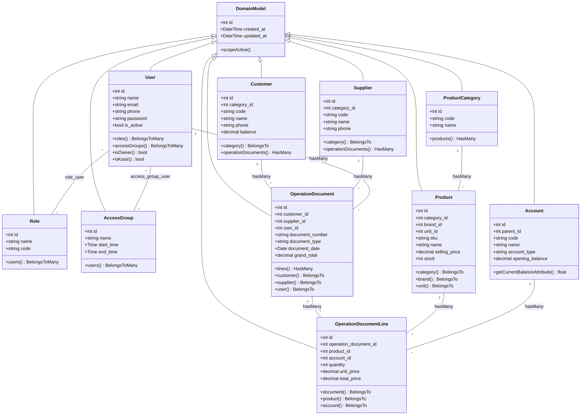

# Dokumentasi Class Diagram & Arsitektur Database POS TB NUR

> **Tanggal Pencatatan**: Sabtu, 8 Agustus 2026  
> **Target Dokumen**: Laporan Skripsi / Tugas Akhir & Bahan Presentasi Sidang  

---

## 📊 1. Mermaid Class Diagram (Struktur Kelas Utama & Relasi)

---

## 📑 2. Rincian Kelas, Atribut, Method, Kardinalitas & Lokasi Codebase

### 👤 Domain Otorisasi & Pengguna (Identity)
* **Base Class Induk**: `DomainModel` ([`DomainModel.php`](file:///d:/Codingan/random/_client_projects/pos_tb_nur/webapp/app/Domain/Support/Models/DomainModel.php))
  * *Atribut Diwarisi*: `id`, `created_at`, `updated_at`.

* **Class `User`** ([`User.php`](file:///d:/Codingan/random/_client_projects/pos_tb_nur/webapp/app/Models/User.php))
  * **Atribut Class**: `id`, `name`, `email`, `phone`, `password`, `is_active`, `remember_token`.
  * **Method Class**: `roles()`, `accessGroups()`, `isOwner()`, `isKasir()`.
  * **Kardinalitas & Relasi**:
    * `User` (1) $\leftrightarrow$ (*) `Role` (*Many-to-Many via table `role_user`*).
    * `User` (1) $\leftrightarrow$ (*) `AccessGroup` (*Many-to-Many via table `access_group_user`*).
    * `User` (1) $\rightarrow$ (*) `OperationDocument` (*1-to-Many / 1 Kasir membuat banyak faktur/nota*).

* **Class `Role`** ([`Role.php`](file:///d:/Codingan/random/_client_projects/pos_tb_nur/webapp/app/Domain/Identity/Models/Role.php))
  * **Atribut Class**: `id`, `name`, `code`, `description`.
  * **Method Class**: `users()`.

* **Class `AccessGroup`** ([`AccessGroup.php`](file:///d:/Codingan/random/_client_projects/pos_tb_nur/webapp/app/Domain/Identity/Models/AccessGroup.php))
  * **Atribut Class**: `id`, `name`, `start_time`, `end_time`, `days_of_week`, `is_active`.
  * **Method Class**: `users()`.

---

### 📦 Domain Katalog & Persediaan (Catalog & Inventory)
* **Class `Product`** ([`Product.php`](file:///d:/Codingan/random/_client_projects/pos_tb_nur/webapp/app/Domain/Catalog/Models/Product.php))
  * **Atribut Class**: `id`, `category_id`, `brand_id`, `unit_id`, `sku`, `name`, `purchase_price`, `selling_price`, `stock`, `min_stock`, `is_active`.
  * **Method Class**: `category()`, `brand()`, `unit()`, `warehouseItems()`.
  * **Kardinalitas & Relasi**:
    * `Product` (*) $\rightarrow$ (1) `ProductCategory` (*Many-to-1*).
    * `Product` (*) $\rightarrow$ (1) `Brand` (*Many-to-1*).
    * `Product` (*) $\rightarrow$ (1) `Unit` (*Many-to-1*).
    * `Product` (1) $\rightarrow$ (*) `OperationDocumentLine` (*1-to-Many / 1 produk dibeli di banyak faktur*).

* **Class `ProductCategory`** ([`ProductCategory.php`](file:///d:/Codingan/random/_client_projects/pos_tb_nur/webapp/app/Domain/Catalog/Models/ProductCategory.php))
  * **Atribut Class**: `id`, `code`, `name`, `description`.
  * **Method Class**: `products()`.

* **Class `Warehouse`** ([`Warehouse.php`](file:///d:/Codingan/random/_client_projects/pos_tb_nur/webapp/app/Domain/Inventory/Models/Warehouse.php))
  * **Atribut Class**: `id`, `code`, `name`, `address`, `is_active`.
  * **Method Class**: `warehouseItems()`, `inventoryDocuments()`.

---

### 🤝 Domain Mitra Bisnis (Partner)
* **Class `Customer`** ([`Customer.php`](file:///d:/Codingan/random/_client_projects/pos_tb_nur/webapp/app/Domain/Partner/Models/Customer.php))
  * **Atribut Class**: `id`, `category_id`, `code`, `name`, `phone`, `email`, `address`, `balance`, `is_active`.
  * **Method Class**: `category()`, `operationDocuments()`.
  * **Kardinalitas & Relasi**: `Customer` (1) $\rightarrow$ (*) `OperationDocument` (*1 Pelanggan memiliki banyak faktur penjualan*).

* **Class `Supplier`** ([`Supplier.php`](file:///d:/Codingan/random/_client_projects/pos_tb_nur/webapp/app/Domain/Partner/Models/Supplier.php))
  * **Atribut Class**: `id`, `category_id`, `code`, `name`, `phone`, `email`, `address`, `balance`, `is_active`.
  * **Method Class**: `category()`, `operationDocuments()`.
  * **Kardinalitas & Relasi**: `Supplier` (1) $\rightarrow$ (*) `OperationDocument` (*1 Pemasok memiliki banyak faktur pembelian*).

---

### 💰 Domain Transaksi Operasional & Akuntansi (Operation & Finance)
* **Class `OperationDocument`** ([`OperationDocument.php`](file:///d:/Codingan/random/_client_projects/pos_tb_nur/webapp/app/Domain/Support/Models/OperationDocument.php))
  * **Atribut Class**: `id`, `branch_id`, `customer_id`, `supplier_id`, `user_id`, `document_number`, `document_type`, `document_date`, `subtotal`, `tax_amount`, `discount_amount`, `grand_total`, `paid_amount`, `payment_status`.
  * **Method Class**: `customer()`, `supplier()`, `user()`, `lines()`, `calculateGrandTotal()`.
  * **Kardinalitas & Relasi**:
    * `OperationDocument` (1) $\rightarrow$ (*) `OperationDocumentLine` (*1 Dokumen Transaksi memiliki banyak baris rincian item/akun*).
    * `OperationDocument` (*) $\rightarrow$ (1) `Customer` (*BelongsTo*).
    * `OperationDocument` (*) $\rightarrow$ (1) `Supplier` (*BelongsTo*).
    * `OperationDocument` (*) $\rightarrow$ (1) `User` (*BelongsTo / Kasir Pencatat*).

* **Class `OperationDocumentLine`** ([`OperationDocumentLine.php`](file:///d:/Codingan/random/_client_projects/pos_tb_nur/webapp/app/Domain/Support/Models/OperationDocumentLine.php))
  * **Atribut Class**: `id`, `operation_document_id`, `product_id`, `account_id`, `description`, `quantity`, `unit_price`, `debit_amount`, `credit_amount`, `total_price`.
  * **Method Class**: `document()`, `product()`, `account()`.

* **Class `Account`** ([`Account.php`](file:///d:/Codingan/random/_client_projects/pos_tb_nur/webapp/app/Domain/Finance/Models/Account.php))
  * **Atribut Class**: `id`, `parent_id`, `code`, `name`, `account_type`, `opening_balance`, `is_active`.
  * **Method Class**: `parent()`, `children()`, `getCurrentBalanceAttribute()`.
  * **Kardinalitas & Relasi**:
    * `Account` (1) $\rightarrow$ (*) `Account` (*Parent-Child Self-Referencing Hierarchy*).
    * `Account` (1) $\rightarrow$ (*) `OperationDocumentLine` (*1 Akun Perkiraan Beban/Kas dipakai di banyak baris jurnal transaksi*).

---

## 📊 3. Total Rangkuman Statistik Arsitektur Aplikasi

* **Total Halaman Antarmuka UI (React)**: **32 Halaman Workspace Aktif**.
* **Total Tabel Database Resmi (`pos_tb_nur`)**: **47 Tabel Database Aktif**.
* **Total Domain Model Classes**: **25 Model Utama** (`app/Domain/` & `app/Models/`).
* **Total Modul Transaksi Operasional**: **6 Jenis Transaksi Utama** (Faktur Penjualan, Penerimaan Kas, Faktur Pembelian, Pembayaran Kas, Pencatatan Beban, & Pencatatan Gaji).

---

## 💡 4. Panduan Menjawab Saat Sidang Skripsi

1. **Jika Dosen Menanya: *"Mengapa jumlah tabel (47) lebih banyak dari jumlah halaman (32)?"***
   * **Jawaban**: *"Karena 1 halaman transaksi utama (seperti Faktur Penjualan) secara backend mengintegrasikan 7 tabel sekaligus (`operation_documents`, `operation_document_lines`, `products`, `customers`, `users`, `numbering_sequences`, dan `activity_logs`). Selain itu ada tabel jembatan relasi (*pivot table*) seperti `role_user` dan `access_group_user`, serta tabel internal Laravel seperti `sessions` dan `cache`."*

2. **Jika Dosen Menanya: *"Bagaimana struktur pewarisan (Inheritance) modelnya?"***
   * **Jawaban**: *"Seluruh model domain mewarisi kelas induk `DomainModel` ([`DomainModel.php`](file:///d:/Codingan/random/_client_projects/pos_tb_nur/webapp/app/Domain/Support/Models/DomainModel.php)) yang menyediakan atribut standar `id`, `created_at`, `updated_at` serta trait pencarian global `searchable`."*
